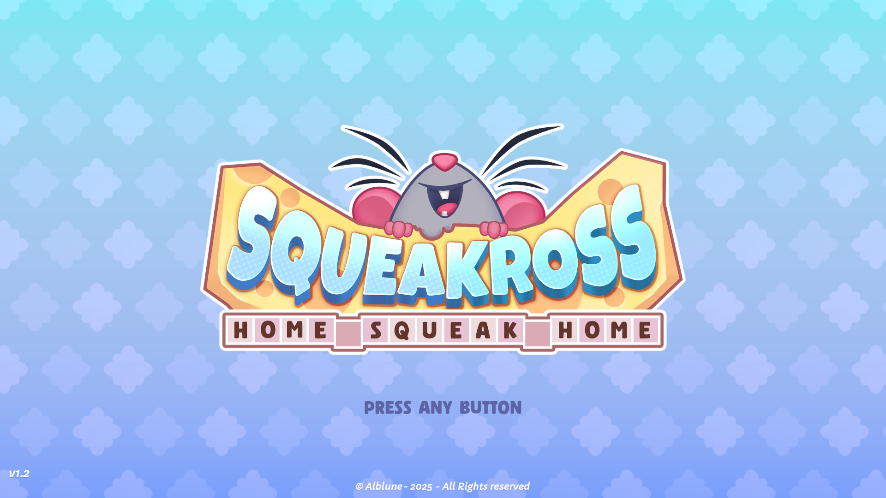

A couple months ago I was hanging out at a friends apartment. We had some time
to kill so they brought out their switch and booted up Squeakross: Home Squeak
Home [^1].



I instantly became addicted and spent the rest of the night with my head firmly
planted in Squeakross. As soon as I left I immediately reccommended it to all of
my friends and got a couple of them hooked.

Squeakross is a game where you solve puzzles to acquire furniture that you use
to furnish a house for your rat-self. The name Squeakross probably comes
from Picross, an earlier series of games where you solve the type of puzzles:
Nonograms.

#### What is a Nonogram?

A Nonogram is a puzzle where you, as the puzzle solver, are given hints about
the makeup of cells inside of a grid. The cells inside of the grid are either
filled or empty. Your goal is to recreate the pattern of filled cells from the
hints you are given.

The hints are given in the form of one or more numbers written above each column
and to the left of each row. Each number corresponds to a chunk made up of that
many filled grid spaces somewhere inside of the column or row. If there is more
than one number, the ordering of the numbers determines the order in which they
show up in the grid. For example, `4 3` in a column means that there is a chunk
of size four followed by a chunk of size three within that column.


##### Itsy-Bitsy Example

That description was a little dense, so let's try to solve this together just
to get a feel for thinking through one of these puzzles. Throughout this I'll
use the convention of 'x' characters to represent an empty space, and a '⬤
'character to represent a filled space.

```goat {class="small-fig"}
      2   1
    .---+---.
 1  |   |   |
    +---+---+
 2  |   |   |
    +---+---+
```

This is a simple 2x2 puzzle. Let's start by looking at the first column.

```goat {class="small-fig arrow-offset"}
        v

        2   1
      .---+---.
   1  |   |   |
      +---+---+
+> 2  |   |   |
      +---+---+
```

Let's take a look at the first and second columns. This puzzle is 2x2 so there
is only one way we can place a chunk of size 2.

```goat {class="small-fig arrow-offset"}
            v

        2   1
      .---+---.
+> 1  | * |   |
      +---+---+
   2  | * | * |
      +---+---+
```

We can also see that 1 is consistent with both the first row and the second
column - in either there is only one filled square. So, we know that the final
unmarked square is empty.

```goat {class="small-fig"}
      2   1
    .---+---.
 1  | * | x |
    +---+---+
 2  | * | * |
    +---+---+
```

We just solved a Nonogram! [^2]

#### How Solve?

If you're anything like me your first thought after solving a couple dozen of
these is something like, "Great! Now how can I solve this with my computer?".
Let's take a look at the Wikipedia article for Nonograms for more information

> "Solving nonogram puzzles is an NP-complete problem. This means that there
> is no polynomial time algorithm that solves all nonogram puzzles unless P
> = NP." [^3]

Oh! So, it seems like there's no way to directly solve Nonograms.


[^1]: You can find the Steam page [here](https://store.steampowered.com/app/2871440/Squeakross_Home_Squeak_Home/); you should give it a look!
[^2]: If this small example got you itching for more there are plenty of free sites on the internet you can use.
[^3]: https://en.wikipedia.org/wiki/Nonogram#Nonograms_in_computing
